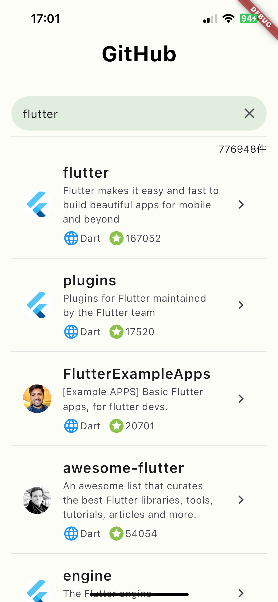
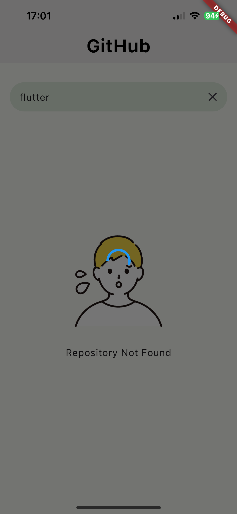
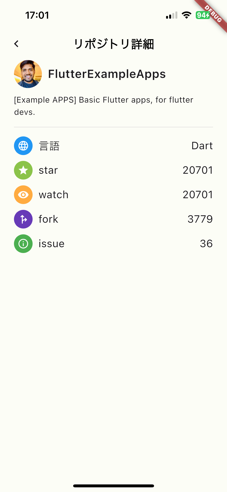
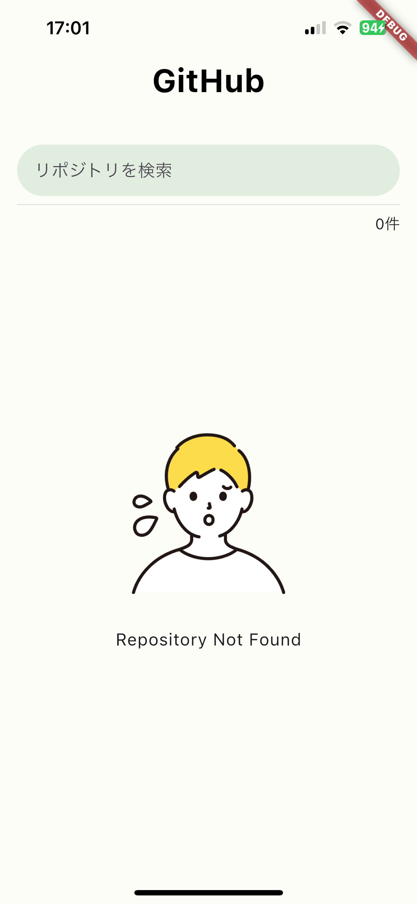
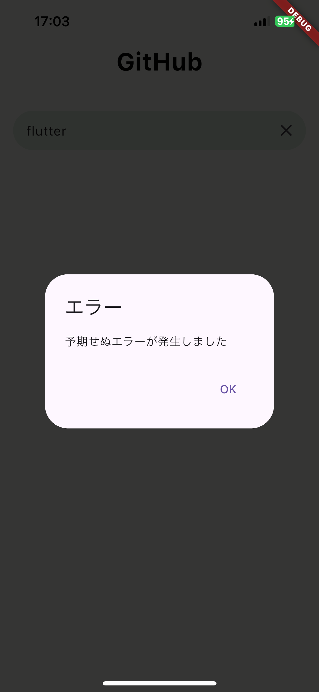

# GitHub Repository Search App

 

## 概要
[GitHub REST API](https://docs.github.com/ja/rest?apiVersion=2022-11-28)を利用してGitHubのリポジトリを検索するアプリです。[株式会社ゆめみのFlutterエンジニアコードチェック](https://github.com/yumemi-inc/flutter-engineer-codecheck)の要件を満たすよう実装しています。
本アプリを通して自分なりの最適なアーキテクチャを確立することを目的に開発しました。

## GitHub Repository Search App
| 一覧 | ローディング時 | 詳細 |
|:---:|:---:|:---:|
|  |  |  |

| 0件 | エラー時 |
|:---:|:---:|
|  |  |

<p align="center">
  
</p>

## 環境構築
### リポジトリをクローン
```bash
git clone https://github.com/yukimiyake0607/git_repository.git
```
### ディレクトリを移動
```bash
cd git_repository_app
```
### fvmをインストール
```bash
brew tap leoafarias/fvm
brew install fvm
```
### プロジェクトで指定されたバージョンのFlutterをインストール
```bash
fvm use
```
### Lefthookをインストール
```bash
brew install lefthook
lefthook install
```
### パッケージをインストール
```bash
fvm flutter pub get
```

## フォルダ構成
<pre>
lib
├── app
│   ├── app.dart
│   └── router.dart
├── core
│   ├── result
│   │   ├── result.dart
│   │   └── result.freezed.dart
│   └── util
│       └── util.dart
├── data
│   ├── datastore
│   │   ├── repository_datastore.dart
│   │   └── repository_datastore.g.dart
│   ├── search_repository_list
│   │   ├── search_repository_list.dart
│   │   └── search_repository_list.g.dart
│   └── usecase
│       ├── repository_usecase.dart
│       └── repository_usecase.g.dart
├── main.dart
├── models
│   ├── repository_exception
│   │   ├── repository_exception.dart
│   │   └── repository_exception.freezed.dart
│   ├── repository_item
│   │   ├── repository_item.dart
│   │   ├── repository_item.freezed.dart
│   │   └── repository_item.g.dart
│   └── searchRepository
│       ├── search_repository.dart
│       ├── search_repository.freezed.dart
│       └── search_repository.g.dart
└── ui
    ├── screens
    │   ├── repository_detail_screen.dart
    │   └── search_screen.dart
    └── widgets
        ├── detail_repository_item.dart
        ├── result_empty.dart
        ├── result_success_screen.dart
        └── textfield_search.dart
</pre>

###フォルダ分割の方針
基本的に関心事ごとにファイルを分割しています。例えば、実際に目に触れるものはすべてUIフォルダに保管しています。ファイル名は関心事.dartとします。

## 環境
|  | バージョン |
|:---:|:---:|
| Dart | 3.5.4 |
| Flutter | 3.24.4 |

## CI
[GitHub Actions](https://github.co.jp/features/actions)を利用してCIを構築しています。
プルリクエストが作成や更新されたときにCIが発火します。